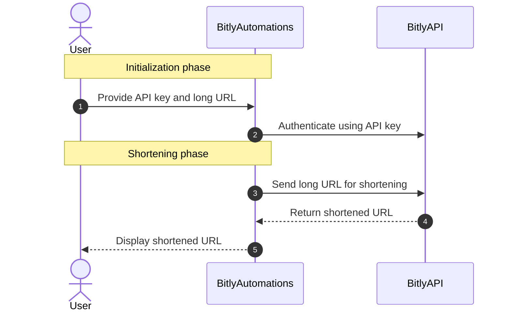

# Bitly Automation
A simple Python script to automate the process of shortening URLs using the Bitly API.

## Blog Post
For a more detailed explanation of the Bitly automation process and a step-by-step guide, please refer to our [blog post](https://pycad.co/bitly-automations/).

## How Bitly Automations Work

## Prerequisites
List any prerequisites or requirements for running the script, such as:

- Python 3.9 or higher
- A Bitly account
- Conda (recommended for managing the environment)

## Environment Setup
Explain how to set up the environment using Conda, as described in the blog post:

- Update Conda
- Create a new Conda environment
- Activate the new environment
- Install the required Python packages
- Install OpenSSL

## Obtaining a Bitly API Key
Outline the steps for obtaining a Bitly API key:

- Sign up for a Bitly account
- Log in and navigate to account settings
- Generate an access token
